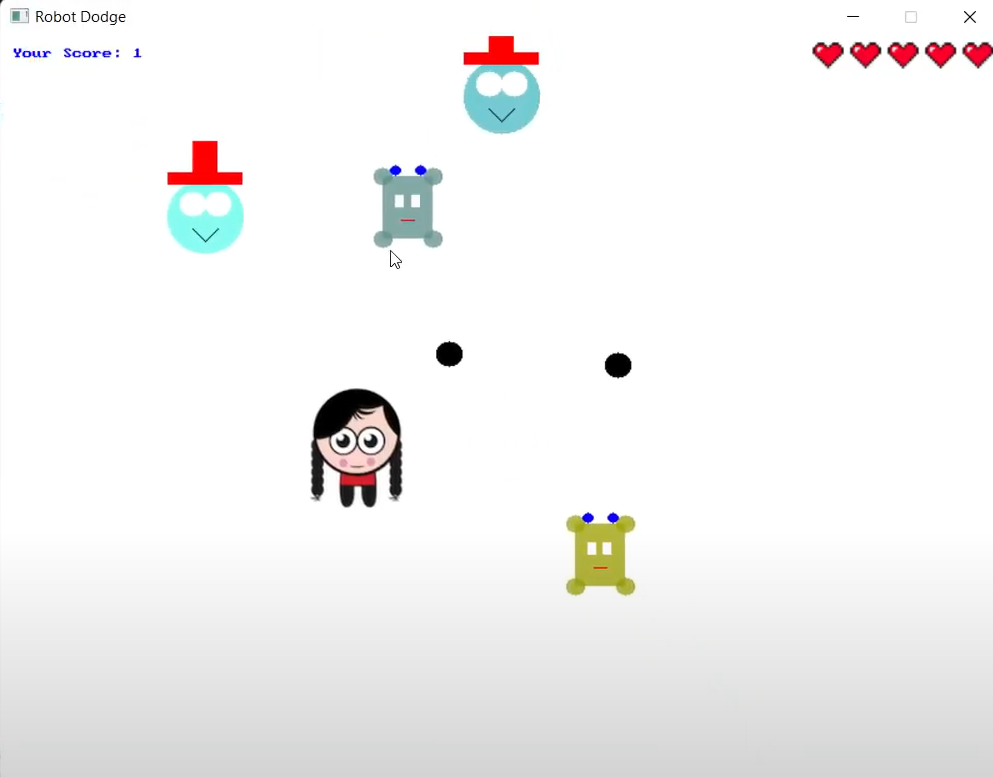

# 🤖 Robot Dodge Game (C#)

Welcome to **Robot Dodge Game**, a fast-paced 2D game where survival is key! Built with **C#** and **SplashKitSDK**, this game showcases engaging gameplay with randomized enemies, shooting mechanics, and score tracking. 🚀

---

## 🎮 About the Game

- **Objective:** Survive as long as you can by dodging and destroying robots while earning points.  
- **Enemies:** Robots of various shapes and colors (Boxy, Hatty, Roundy, Noob, ColorRoundy) spawn randomly and chase you.  
- **Challenge:** With limited lives and unpredictable robot movement, every second counts!  

---

## 🌟 Features

- **Player Controls:**
  - Move with `Arrow Keys`.
  - Shoot bullets with the `left mouse click`.
  - Quit the game anytime with `Escape`.  

- **Dynamic Gameplay:**  
  - Robots spawn from all directions and use tracking to chase the player.  
  - Bullet mechanics for shooting and destroying enemies.  

- **Scoring System:**  
  - Gain points for survival time.  
  - Visual life counter (5 lives to start).  

---

## 🛠️ Tech Stack

- **Programming Language:** C#  
- **Framework:** [SplashKitSDK](https://splashkit.io/)  

---

## 🚀 How to Run the Game

**1.** Clone this repository to your local machine.\
**2.** Locate the **"Game"** folder.\
**3.** Run the **RobotDodgeGame.exe** and enjoy!

---

## 📸 Screenshots

---

## Gameplay
Click below to watch the video!

## 🚧 Future Enhancements

- Add power-ups like shields or rapid fire.  
- Introduce difficulty levels for progressive challenges.  
- Implement a leaderboard to track high scores.  

---

## 🤝 Acknowledgments

This project was built using **SplashKitSDK**, a fantastic library for game development in C#. Big thanks to its developers for their resources and tools!  

---

## 📬 Contact

Have feedback or suggestions? Feel free to reach out:  
📧 [sathiyanarayanan.s1698@gmail.com](mailto:sathiyanarayanan.s1698@gmail.com)  

Enjoy playing **Robot Dodge Game**! 🎉
